# PROJECT Design Documentation

## Team Information
* Team name: 2208-SWEN-261-01-2-Fanta
* Team members
    * Dominic Kavanagh - dsk1354@rit.edu
    * Jesse Burdick-Pless - jb4411@rit.edu
    * Jess Zhao - jlz6146@rit.edu
    * Eric Landers - esl7511@rit.edu

## Executive Summary

WebCheckers is a web-app that simulates checkers played with American rules.

The goal for the project is to allow players to sign in and challenge other players to a game of checkers.
In addition, we have added a spectator mode to further enhance the player
experience.

The application uses Spark and Freemarker for webpage rendering.

### Purpose
The WebCheckers application allows users to play checkers anytime, anywhere. It provides a simple way for players to challenge each other to a classic game of checkers from the convenience of their web browser.

### Glossary and Acronyms

| Term | Definition |
|------|------------|
| Cyclomatic Complexity | v(G) |
| Essential Cyclomatic Complexity | ev(G) |
| Design complexity | iv(G) |
| Cognitive Complexity | CogC |
| Average Operation Complexity | OCavg |
| Maximum Operation Complexity | OCmax |
| Weighted Method Complexity | WMC |

## Requirements

This section describes the features of the application.

### Definition of MVP
>  1. Every player must sign-in before playing a game, and be able to sign-out when finished playing.
       
> 2. Two players must be able to play a game of checkers based upon the American rules.
      
> 3. Either player of a game may choose to resign, at any point, which ends the game.

### MVP Features
###Epics
>1. Epic: Moving a Checker Stories

###User Stories
> 1. Sign-Out
> 2. Moving a Normal Checker
> 3. Jump Move
> 4. Capture Checker
> 5. Choice of Jump Move
> 6. Multiple Jump Move
> 7. Kinging a Normal Checker
> 8. Moving a King Checker
> 9. Ending a Game
> 10. Resignation
> 14. Player Sign-in
> 15. Start a Game

### Roadmap of Enhancements
> 1. Spectate an Ongoing Game
> 2. Have the option for a player not in a game to click on the username of a different player that is in a game.
     That player will be rerouted to that CheckersGame and will be able to watch the game play out in real time.

 

## Application Domain

A game of WebCheckers is played by two players on an 8 by 8 checkerboard. Each player starts with 12 pieces (either
red or black), which they control. On their turn, a player moves one piece of their color. The user interface
consists of the home page, the signin page, and the game page. Players start on the home page, from which they can get
to the signin page. Once a player signs in with a unique username, they will be redirected back to the home page where
they will now be able to see other active players. At this point they can either wait to be challenged by another
player, or they can challenge a player. Once they have challenged a player, or have been challenged by another player,
both players will be redirected to the game page. On the game page, starting with the red player, players take
turns making moves. After the current player makes a move, their turn ends, and the other player's turn begins. This
cycle continues until a player wins the game or a player resigns.

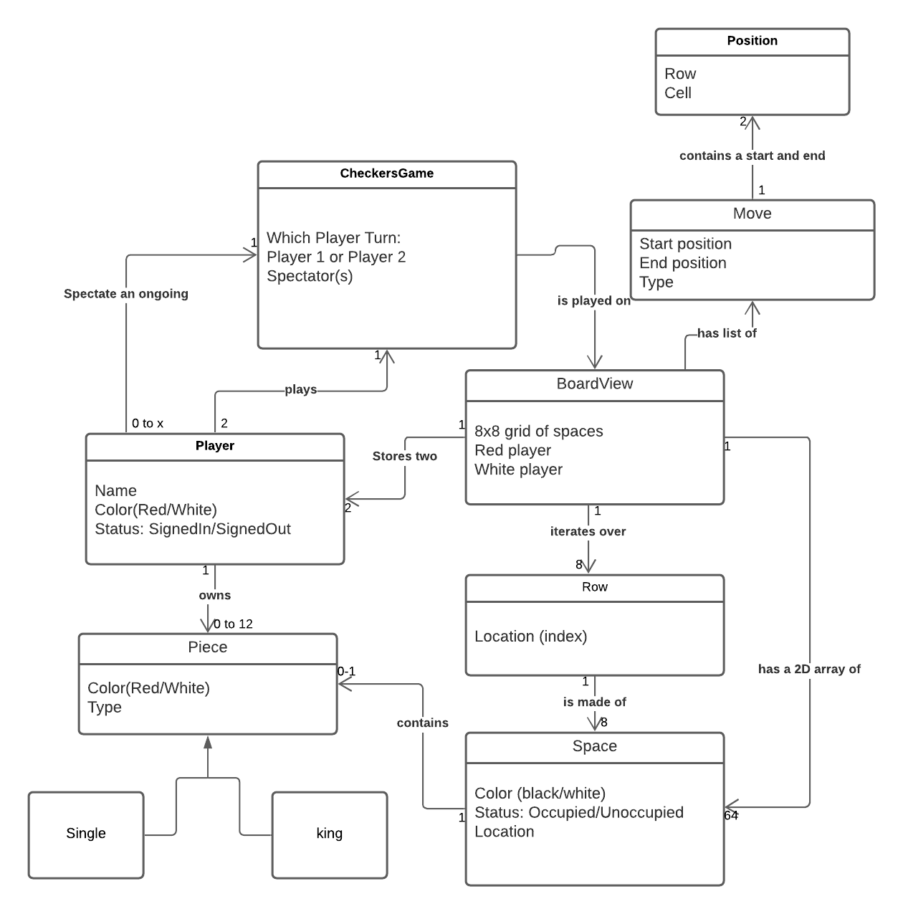

## Architecture and Design

This section describes the application architecture.

### Summary

The following Tiers/Layers model shows a high-level view of the webapp's architecture.

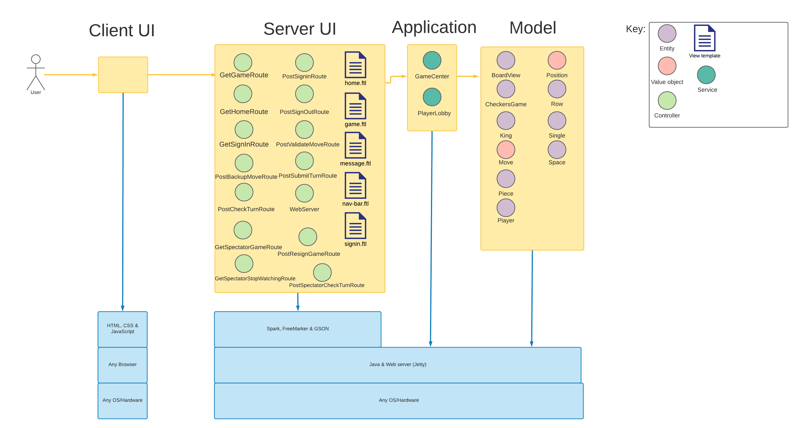

As a web application, the user interacts with the system through their browser. The client-side of the UI is comprised
of HTML pages with some minimal CSS for styling. There is also some JavaScript that has been provided to the team by the
architect.

The server-side tiers include the UI tier that is composed of UI controllers and views. Controllers were built using the
Spark framework, and the views were built using the FreeMarker engine. The application and model tiers were built using
Java objects.

### Overview of User Interface

The user interface consists of the home page, the signin page, and the game page.

The user starts off at the homepage, from which they can get to the signin page. On the signin page they can sign in
with a valid, unique username.  Once a player signs in, they are redirected back to the home page where they can see the
names of other active players. At this point they can either wait to be challenged by another player, or they can
challenge an unoccupied player.

Once on the game page, starting with the red player, players take turns making moves. After the current player finishes
making a move, their turn ends, and the other player's turn begins. This cycle continues until a player wins the game,
or a player resigns.

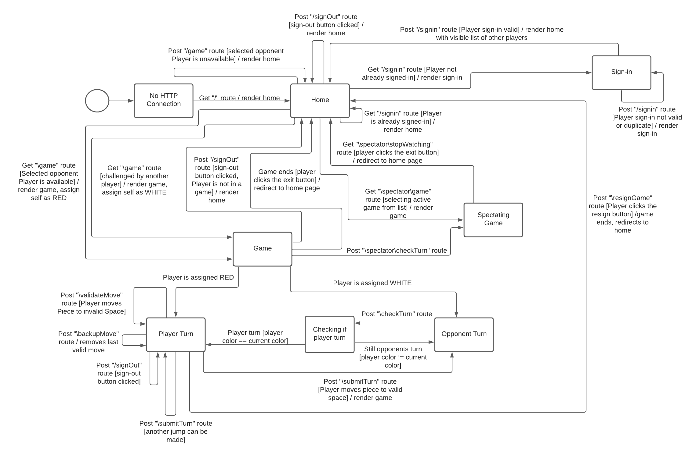

### UI Tier
The UI Tier has ten classes, three handle GET requests, six handle POST requests, and the last handles the initialization of the HTTP routes.

GetGameRoute:
> UI controller to GET the “/game” route.

GetHomeRoute:
> UI controller to GET the “/” route. If a player is signed in, the home page will display a list of all signed-in players.

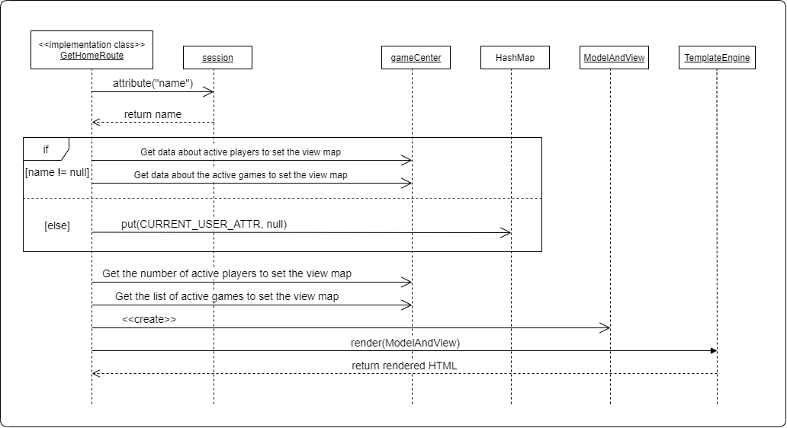

GetSignInRoute:
> UI controller to GET the “/signin” route. Renders a page for the user to enter a username to sign in.

PostBackUpMoveRoute:
> UI controller to POST the “/backupMove” route. Backs up the last move made this turn, if a move has been made.

PostCheckTurnRoute:
> UI controller to POST the “/checkTurn” route. Checks which player’s turn it is by checking if the opponent has
> submitted their turn.

PostSignInRoute:
> UI controller to POST the “/signin” route. If the user has entered an acceptable username, it renders the homepage.
> Otherwise, it remains on the sign-in page.

PostSignOutRoute:
> UI controller to POST the “/signout” route. If a player attempts to sign out while in a game, an error message occurs.
> Otherwise, it renders the home page.

PostSubmitTurnRoute:
> UI Controller to POST the “submitTurn” route. If the entirety of a player’s turn is valid, the turn is submitted,
> and that player's turn ends.

PostValidateMoveRoute:
> UI Controller to post the “validateMove” route. If a player’s move is valid, it is executed.

PostSpectatorCheckTurnRoute:
> UI Controller to post the “spectatorCheckTurn” route. Executes to ensure the spectator can see each turn that is done by the players

GetSpectatorGameRoute:
> UI controller to GET the spectatorGameRoute. It executes to redirect the spectator to game.ftl.

GetSpectatorStopWatchingRoute:
> UI Controller to GET spectatorStopWatchingRoute. It executes to redirect the spectating player to home.ftl when they stop spectating.

PostResignGameRoute:
> UI Controller to post the “resignGame” route. Executes when a player chooses to resign a game

WebServer:
> Initializes the all the HTTP routes used by the WebCheckers application.

### Application Tier
The application tier has two classes that act as services, GameCenter and PlayerLobby.

GameCenter:
> This class is responsible for saving and storing played games, and has methods for retrieving these games.
> Additionally it can create and end games as needed.

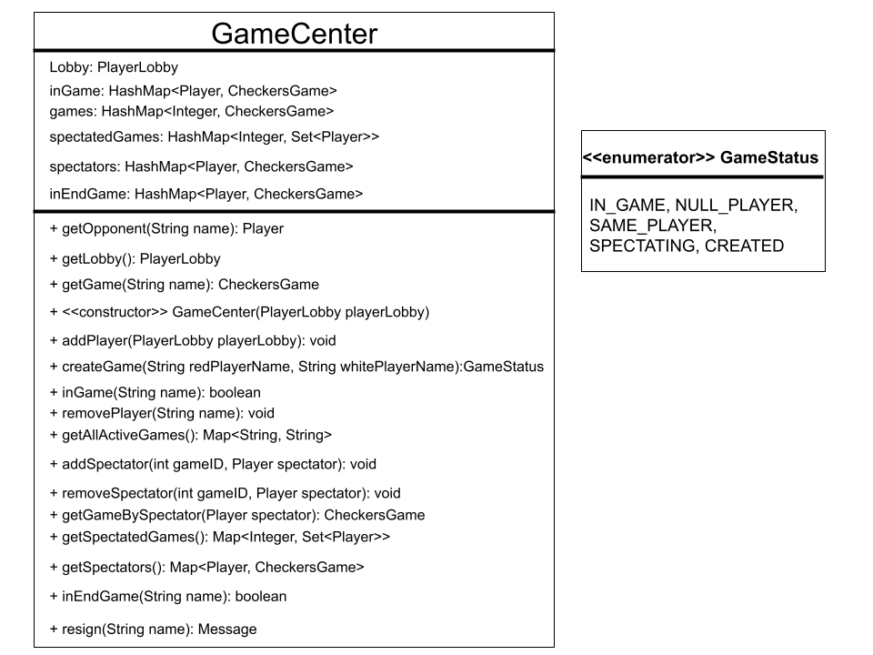

PlayerLobby:
> This class is responsible for containing players that have logged in, and can add and remove players as needed.

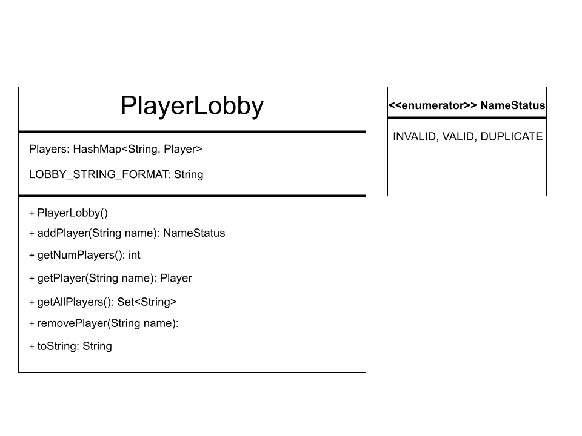

### Model Tier
The model tier has ten classes, two of which are value objects, the rest of which are entities. These are responsible for
processing user requests and domain entities that the user can interact with.

BoardView:
> This class handles how the player views the board throughout the game. It does this by constructing the board out of an
> iterable structure of Row objects, by providing methods to check if a potential move is valid, and by providing error
> messages for invalid moves.

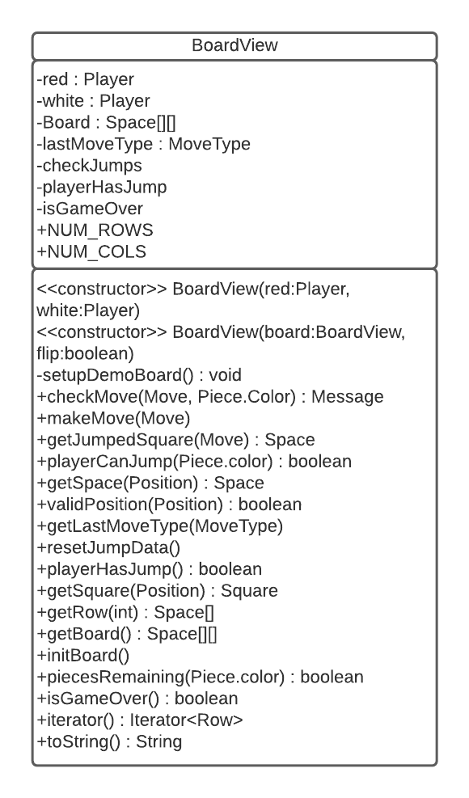

CheckersGame:
> This class represents a game that a player can participate in, and ensures that the players take their turns properly.

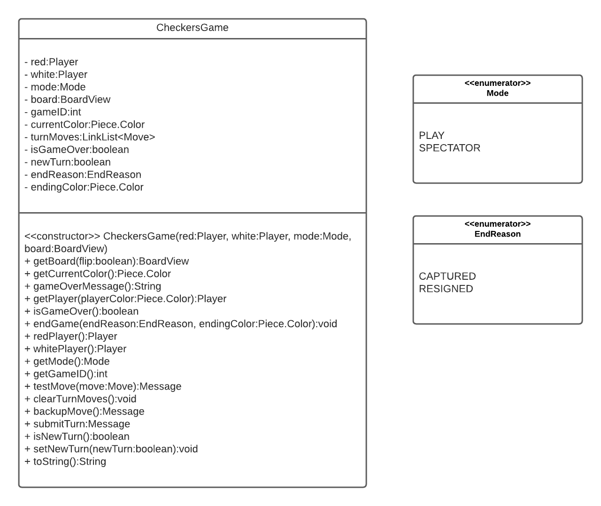

Player:
> Holds player information such as color and name.

Position:
> Contains information regarding the position of a square on the board.

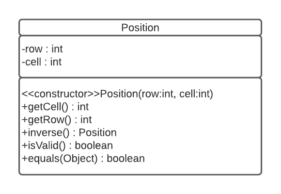

Row:
> Creates an iterable structure of Space objects to represent a row on a checkerboard.

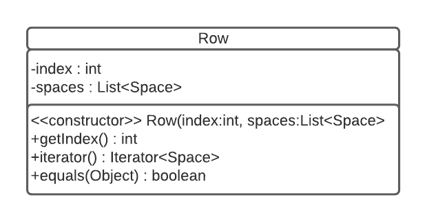

Space:
> Represents a single square on the checkerboard, and contains information regarding if it is holding a piece, or if a
> player can move to it.

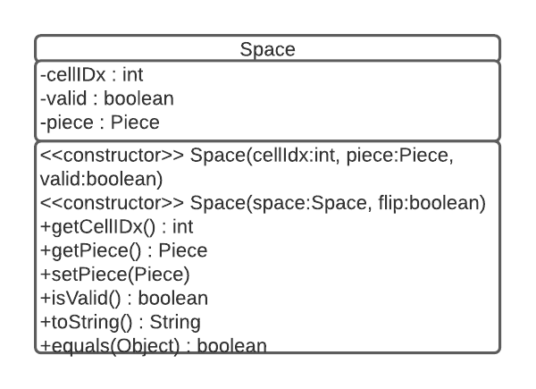

Move:
> A value object that represents a player’s move. It is immutable and determines if a player is making a jump move or a
> single move.

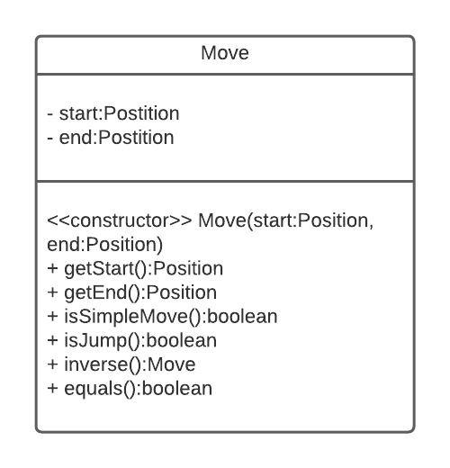

Piece:
> An abstract class representing a checkers piece.

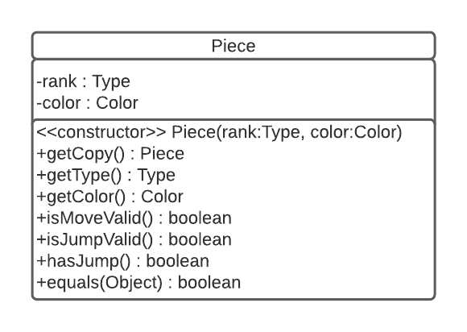

King:
> A concrete implementation of the piece class, used to represent a king checker.

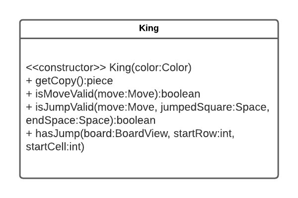

Single:
> A concrete implementation of the piece class, used to represent a normal checker.

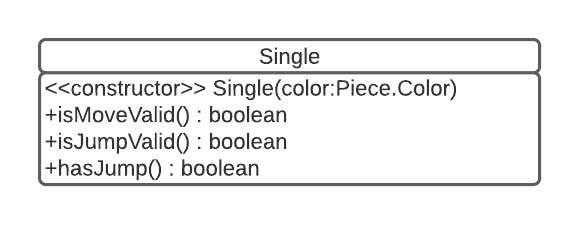

### Design Improvements

All of the methods discussed below in the code metrics section could potentially benefit from refactoring, however there are some that stand out as the highest priority hotspots.

The three big design improvement possibilities we see are in our UI routes. To maintain architectural separation, and allow new user interfaces to be implemented easily, the UI tier should contain little to no actual logic. However, GetGameRoute, GetHomeRoute, and to a lesser degree, PostSigninRoute, all contain logic that could be moved out of the UI tier.

CheckersGame has one method in particular that would greatly benefit from refactoring. CheckersGame.submitTurn() is one of the longest methods in our implementation of WebCheckers. On top of being extremely long, the method is also hard to follow and understand. Splitting this method into smaller, simpler pieces would likely prove to be quite challenging, however given the importance of this method in the overall operation of the application, refactoring this method to be more easily understood and tested would be crucial, especially if more functionality is added to the application in the future.

Another hotspot is in BoardView, specifically its checkMove() method. Currently this method is quite long and confusing, in fact it is only 5 lines shorter than CheckersGame.submitTurn(). By refactoring this method and splitting it into smaller, less confusing parts, testing would be made much easier, as well as making it easier to change and update in the future.

## Testing

### Acceptance Testing
Number of user stories that have passed all acceptance criteria test: 10 (all stories for sprints 1 & 2)

Number of user stories that have some acceptance criteria test failing: 0

Number of user stories for sprints 1 & 2 & 3 that have not had any testing yet: 0

Issues found during testing:
> During sprint 2 we had one issue where the SignOut link was available on the GamePage when it should not have been. We fixed this issue without any problems.

During Sprint 3 we had an issue where games could be spectated after it had ended. However this issue was quickly resolved.

We also had an issue where checkers would not be kinged when they got to the end row with a simple move, this was easily fixed.

Another issue we ran into was players being able to challenge players who were spectating an ongoing game. However as with the previous issues, this was fixed quite easily.

### Unit Testing and Code Coverage
Testing Strategy:

We started by testing the classes in the application tier so that when it came time for testing the UI tier, we were able to use the application tier classes as friendly objects. We attempted to get 100% code coverage by creating multiple iterations of the tests for all classes.

We aimed for and were able to achieve 100% code coverage in all classes besides the given classes (WebServer, Application, and Message).

We believed that by having 100% coverage, we could be absolutely sure that there were no code smells or bugs.

###Application Tier Coverage
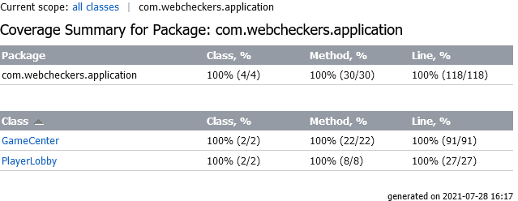

###Model Tier Coverage
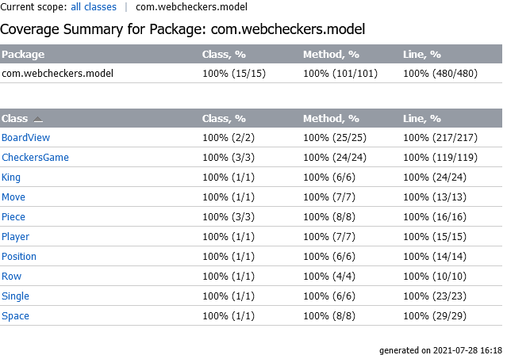

###UI Tier Coverage
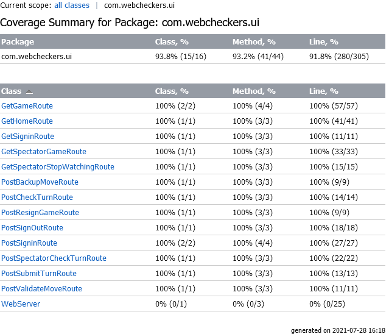

#Code Metrics
##Chidamber-Kemerer metrics
Our code is within the normal ranges for the Chidamber-Kemerer metrics.

The only metrics where our code reaches outside the normal ranges are the Complexity metrics. Within the Complexity metrics, our Package, Module, and Project metrics are all within normal ranges, however in the Method and Class metrics, there are some notable outliers.

##Complexity metrics
###Method Metrics
Cyclomatic Complexity (v(G)) is one way of measuring the complexity of code. This is a count of individual execution paths through a method. This essentially measures how difficult a method is to test. A higher number of possible paths through a method will generally make testing more complex. Writing testable code is extremely important, and high Cyclomatic Complexity can be a good indicator that there is hard to test code that might benefit from refactoring.

Essential Cyclomatic Complexity (ev(G)) and Cyclomatic Complexity are different, but closely related. If a method has low Essential Cyclomatic Complexity, that means the method can be broken up into smaller methods fairly easily. If we have a hard to test method that has high Cyclomatic Complexity, but low Essential Cyclomatic Complexity, that suggests we could, without much work, break said method into smaller parts that could each be tested individually.

Design complexity (iv(G)) is related to how many links to other methods a method has during its execution. The Design Complexity can range from 1 to the Cyclomatic Complexity of the method. In essence, Design Complexity also represents the minimum number of tests needed to test the integration of the method with any other methods it calls during execution.

Finally we have Cognitive Complexity (CogC). Cognitive Complexity is similar to Cyclomatic Complexity in many ways, however its purpose is different. Cognitive Complexity is intended to measure the understandability of code specifically, which can be quite different from the testability of code. Each control structure used in a method will increase Cognitive Complexity, and nested control structures will do the same.

| Method metrics                                                   | CogC  | ev(G) | iv(G) | v(G) |
| ---------------------------------------------------------------- | ----- | ----- | ----- | ---- |
| com.webcheckers.application.GameCenter.createGame(String,String) | 7     | 5     | 6     | 8    |
| com.webcheckers.application.PlayerLobby.addPlayer(String)        | 3     | 4     | 2     | 4    |
| com.webcheckers.model.BoardView.checkMove(Move,Color)            | 26    | 15    | 6     | 18   |
| com.webcheckers.model.BoardView.movesRemaining(Color)            | 12    | 5     | 6     | 7    |
| com.webcheckers.model.BoardView.piecesRemaining(Color)           | 7     | 4     | 4     | 5    |
| com.webcheckers.model.BoardView.playerCanJump(Color)             | 7     | 4     | 5     | 6    |
| com.webcheckers.model.BoardView.setupDemoBoard()                 | 49    | 1     | 29    | 29   |
| com.webcheckers.model.CheckersGame.gameOverMessage()             | 9     | 5     | 5     | 6    |
| com.webcheckers.model.CheckersGame.submitTurn()                  | 28    | 4     | 14    | 19   |
| com.webcheckers.ui.GetGameRoute.handle(Request,Response)         | 13    | 5     | 10    | 15   |
| com.webcheckers.ui.GetHomeRoute.handle(Request,Response)         | 10    | 2     | 7     | 11   |
| **Total**                                                            | **171**   | **54**    | **94**    | **128**  |
| Average                                                          | 15.55  | 4.91   | 8.55   | 11.64 |

Within our application tier, the GameCenter.createGame() method has an ev(G) of 5, which falls slightly outside the normal range. This indicates that splitting the method up into smaller pieces could be slightly challenging, however given this method has a v(G) that is within the normal range, splitting up this method is not necessary as it is not hard to test as it is.

The PlayerLobby.addPlayer() method has an ev(G) of 4, which again falls slightly outside the normal range. Similar to GameCenter.createGame(), PlayerLobby.addPlayer() has a v(G) that is within the normal range, so as before, splitting up this method is not necessary as it is not hard to test as it is.

Next we move on to the model tier. The BoardView.checkMove() method has a CogC of 26, an ev(G) of 15, and a v(G) of 18. A CogC of 26 indicates that this method may be quite hard to understand, and might benefit from some refactoring to increase readability. The combination of both high ev(G) and v(G) indicates that this method is likely hard to test, and unfortunately, also hard to split up into smaller pieces. BoardView.checkMove() is one of the largest methods in our implementation of WebCheckers and could definitely be improved by splitting it up into smaller, less complicated pieces. However, as indicated by the high ev(G), finding good spots to split up this method would be challenging. The main approach we could see would be to have a method for the initial set of checks, a method that checks the move if it is a simple move, and a method that checks the move if it is a jump move. This would likely improve the understandability of the code, and make testing it easier.

The BoardView.movesRemaining() method has an ev(G) of 5, which falls slightly outside the normal range. As this method has a v(G) that is within the normal range, splitting up this method is not necessary as it is not hard to test as it is.

The BoardView.piecesRemaining() and BoardView.playerCanJump() methods both have an ev(G) of 4. As both methods have a v(G) that is within the normal range, splitting up these methods is not necessary as they are not hard to test in their current states.

The BoardView.setupDemoBoard() method has a CogC of 49, an iv(G) of 29, and a v(G) of 29. These are all outside of the normal range for these metrics, however we believe that despite this, no changes need to be made. This method is only used for demonstrations of the product’s functionality, and therefore is never used under normal operation. As well, in spite of what these metrics imply, this method is fairly simple, consisting of a set of if else statements that checks if either player in this game is using a username that corresponds to a backdoor for a specific demo board, and if so, it will set up said demo board. For these reasons we believe no further work is necessary in this method. However, as indicated by its ev(G) of 1, splitting this method into smaller components would not be too challenging.

The CheckersGame.gameOverMessage() method has an ev(G) of 5, which falls slightly outside the normal range. As this method has a v(G) that is within the normal range, splitting up this method is not necessary as it is not hard to test as it is.

The CheckersGame.submitTurn() method has a CogC of 28, an ev(G) of 4, an iv(G) of 14, and a v(G) of 19. A CogC of 28 indicates that this method is almost certainly quite hard to understand, and would likely benefit from some refactoring to increase readability. A v(G) of 9 also indicates that this method could be tested more easily if it was split up into smaller pieces. An ev(G) of 4 is slightly outside of the normal range, meaning splitting this method up might be somewhat hard, but not impossible. The high iv(G) shows that this method calls many other methods during execution. This makes testing more challenging, however there is not much that can reasonably be done to change this; the nature of the method means that calling many other methods is essentially unavoidable. However splitting this method up into smaller pieces would help somewhat, as each smaller piece could be tested individually.

Next we move on to the UI tier. The GetGameRoute.handle() method has an ev(G) of 5, an iv(G) of 10, and a v(G) of 15.These metrics indicate there is functionality in the UI tier that should be moved to another tier, likely the application tier, to reduce the complexity of the UI. This is confirmed by the high v(G). The UI tier should have to interact with other classes as little as possible to reduce the complexity of the UI. This method could definitely benefit from some refactoring to move functionality out of this method, and out of the UI tier. We can see from the ev(G) of 5 that splitting this method into smaller parts would be doable, but not trivial. Such refactoring would also help reduce the high v(G), and thus make testing this class easier.

The GetHomeRoute.handle() method has a v(G) of 11. This high v(G) should not be present in a UI tier component. Some refactoring to move functionality out of this method, and out of the UI tier would make testing this class easier. Luckily, GetHomeRoute.handle() has an ev(G) of 2, meaning it would likely be quite easy to do such refactoring.

The metrics for all of the other methods in our implementation of WebCheckers fall within the normal ranges.

###Class Metrics

Now we consider the class metrics that are outside of the normal range. However as before we will first explore what these metrics actually mean.

Average Operation Complexity (OCavg) calculates the average Cyclomatic Complexity of all non-abstract methods in a class. Thus the Average Operation Complexity gives a decent estimate of how hard it will be to test the methods in a class.

Maximum Operation Complexity (OCmax) is the Maximum Cyclomatic Complexity out of the non-abstract methods in a class. We do not have any classes with a Maximum Operation Complexity that exceeds the normal range. Although parts of our code have an Average Operation Complexity that is outside of the normal range, despite this, none of our code has a Maximum Operation Complexity that exceeds the normal range. This shows that at least when it comes to Cyclomatic Complexity, our code does not contain any outliers that could be skewing our Average Cyclomatic Complexity above where it should be.

Finally, Weighted Method Complexity (WMC) calculates the total Cyclomatic Complexity of all methods in a class. This gives a decent idea of which classes are likely to be the hardest to test overall.

| Class metrics                                                    | OCavg | OCmax | WMC   |
| ---------------------------------------------------------------- | ----- | ----- | ----- |
| com.webcheckers.application.GameCenter                           | 1.79  | 5     | 34    |
| com.webcheckers.model.BoardView                                  | 3.68  | 22    | 81    |
| com.webcheckers.model.CheckersGame                               | 2.21  | 13    | 42    |
| com.webcheckers.ui.GetGameRoute                                  | 7.00     | 13    | 14    |
| com.webcheckers.ui.GetHomeRoute                                  | 5.50   | 10    | 11    |
| com.webcheckers.ui.PostSigninRoute                               | 3.50   | 6     | 7     |
| **Total**                                                            |       |       | **189**   |
| Average                                                          | 3.95  | 11.5 | 31.5 |

Within the application tier, the GameCenter class has a WMC of 34. We can see from this that some refactoring in this class could improve testability, which should be examined. This is consistent with what we saw in the method metrics above.

With respect to the model tier, the BoardView class has an OCavg of 3.68, and a WMC of 81. This class is the most problematic when it comes to our code metrics, and given what we saw in the method metrics above, these results are not surprising. As we discussed above, refactoring the BoardView class could improve both its testability and understandability.

The CheckersGame class has a WMC of 42. We can see from this that some refactoring in this class could improve testability, and should be considered. This is consistent with what we saw in the method metrics above.

With Respect to the  to the UI tier, theGetGameRoute class has an OCavg of 7. This is consistent with what we saw in the method metrics above. Refactoring the GetGameRoute.handle() method to move functionality out of the UI tier would both reduce GetGameRoute’s OCavg, and reduce the complexity of the UI.

The GetHomeRoute class has an OCavg of 5.5. This is consistent with what we saw in the method metrics above. Refactoring the GetHomeRoute.handle() method to move functionality out of the UI tier would both reduce GetHomeRoute’s OCavg, and reduce the complexity of the UI.

The PostSigninRoute class has an OCavg of 3.5. Some refactoring to move functionality out of this method, and out of the UI tier would make testing this class easier. None of the methods in the class exceed the normal range for the method metrics, meaning it would likely be easy to perform such refactoring.

##Remaining Metrics
Our code is within the normal ranges for all of the Javadoc coverage metrics, all of the Lines of code metrics, and all of the Martin package metrics.

#Initial code metrics:
These are the code metrics from when we first did metric analysis in Sprint 3 for the Code Metrics exercise. 
##Chidamber-Kemerer metrics:
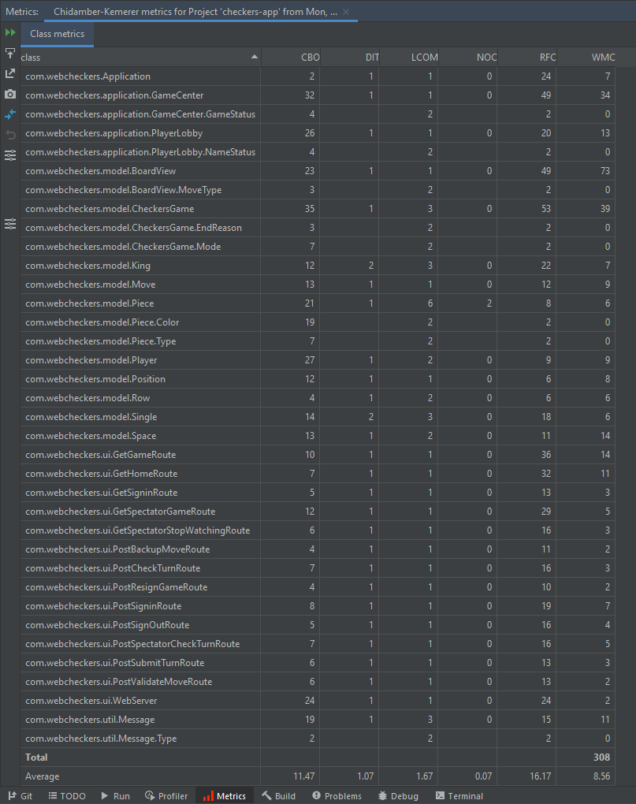

##Complexity metrics:

###Method metrics:
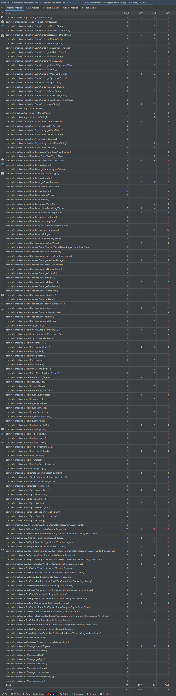

###Class metrics:
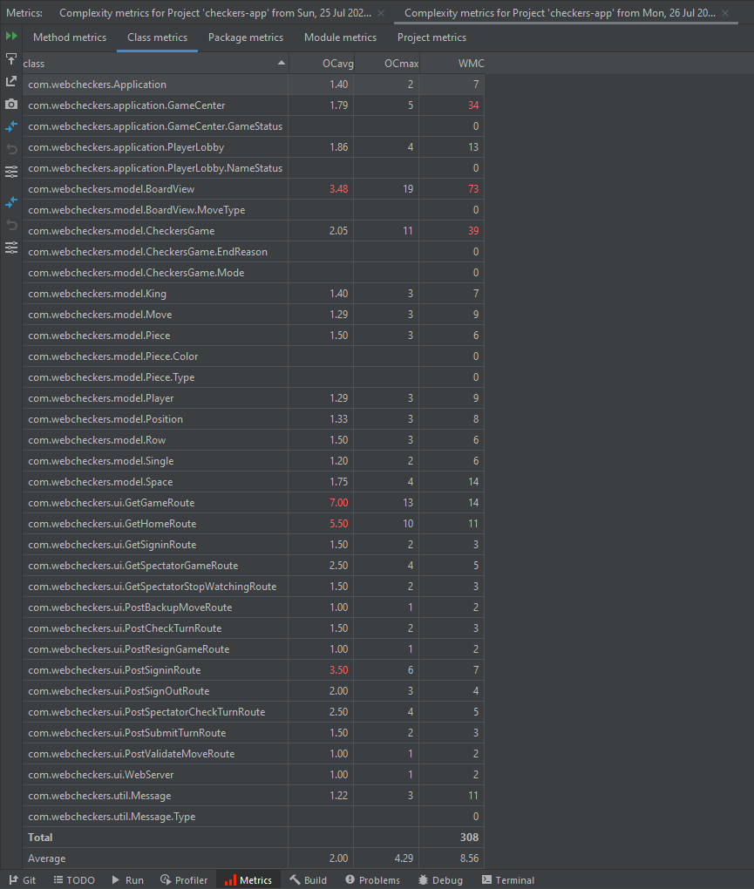

###Package metrics:
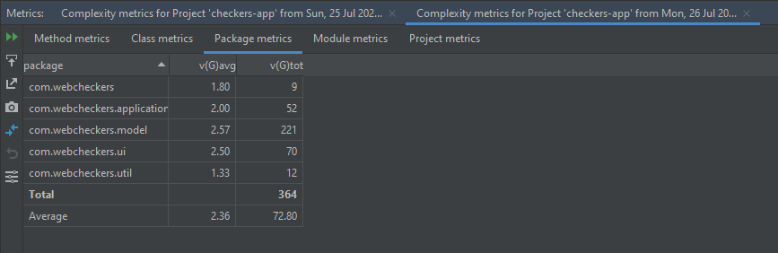

###Module metrics:
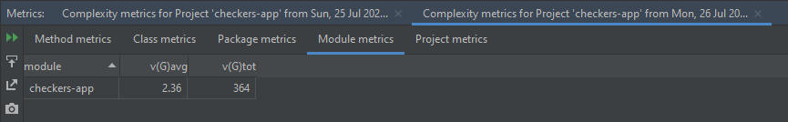

###Project metrics:
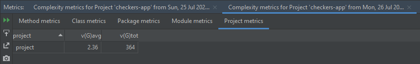

##Javadoc coverage metrics:

###Method metrics:
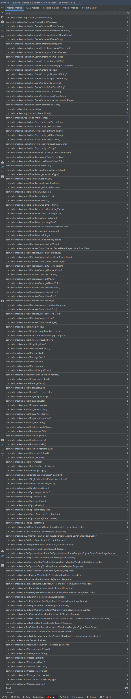

###Class metrics:

###Package metrics:
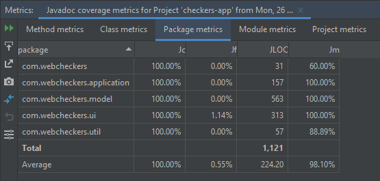

###Module metrics:
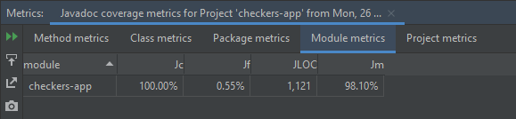

###Project metrics:
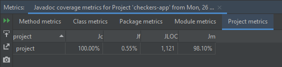

##Lines of code metrics:

###Method metrics:
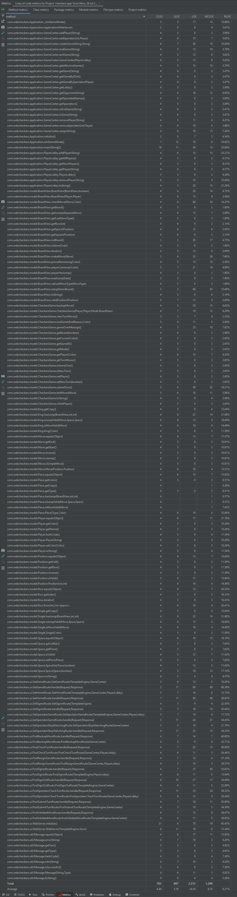

###Class metrics:
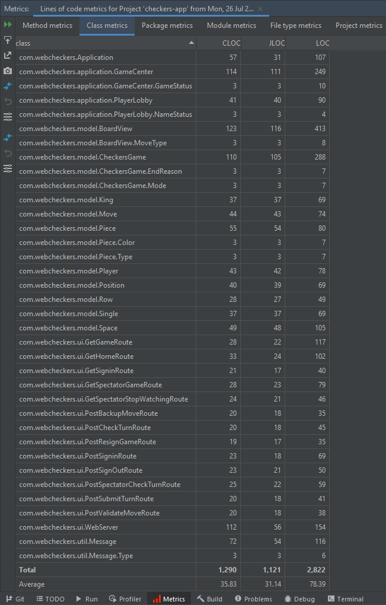

###Package metrics:
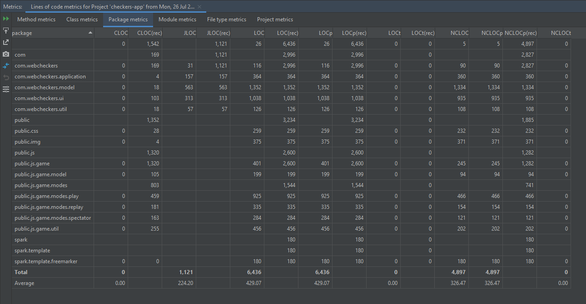

###Module metrics:
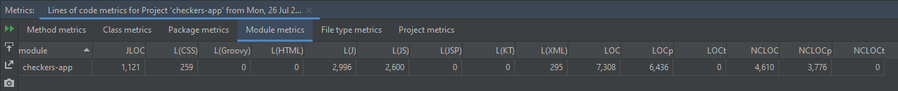

###File type metrics:
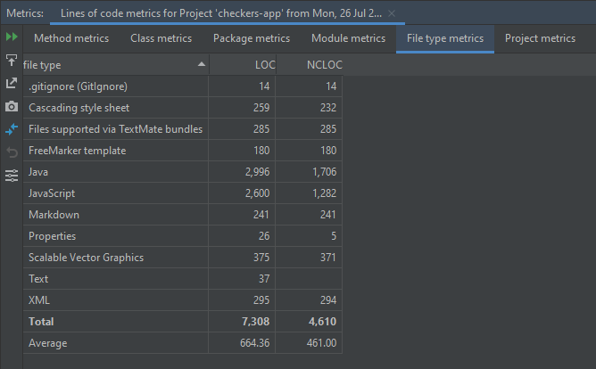

###Project metrics:
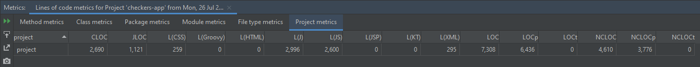

##Martin package metrics:
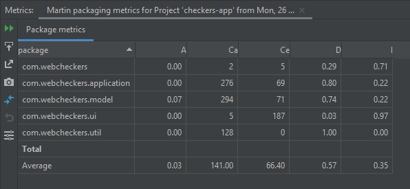